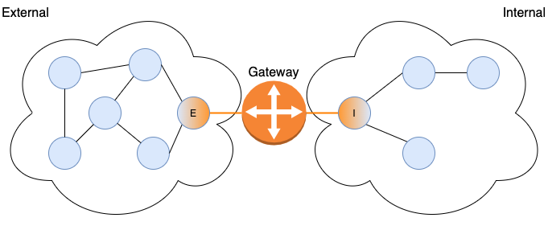

.. _communication:

Communication
=============

Broker's primary objective is to facilitate efficient communication through a
publish/subscribe model. In this model, entities send data by publishing to a
specific topic, and receive data by subscribing to topics of interest. The
asynchronous nature of publish/subscribe makes it a popular choice for loosely
coupled, distributed systems.

Broker is the successor of Broccoli.  Broker enables arbitrary
applications to communicate in Zeek's data model. In this chapter, we
first describe generic Broker communication between peers that don't
assume any specific message layout. Afterwards, we show how to exchange
events with Zeek through an additional Zeek-specific shim on top of
Broker's generic messages.

Exchanging Broker Messages
--------------------------

We start with a discussion of generic message exchange between Broker
clients. At the Broker level, messages are just arbitrary values
that have no further semantics attached. It's up to senders and
receivers to agree on a specific layout of messages (e.g., a set of
doubles for a measurement series).

.. _endpoint:

Endpoints
~~~~~~~~~

Broker encapsulates its entire peering setup in an ``endpoint``
object. Multiple instances of an ``endpoint`` can exist in the same
process, but each ``endpoint`` features a thread-pool and
(configurable) scheduler, which determines the execution of Broker's
components. Using a single ``endpoint`` per OS process guarantees the
most efficient usage of available hardware resources. Nonetheless,
multiple Broker applications can seamlessly operate when linked
together, as there exists no global library state.

.. note::

  Instances of type ``endpoint`` have reference semantics: that is, they behave
  like a reference in that it's impossible to obtain an invalid one (unlike a
  null pointer). An ``endpoint`` can also be copied around cheaply, but is not
  safe against access from concurrent threads.

Peerings
~~~~~~~~

In order to publish or receive messages an endpoint needs to peer with other
endpoints. A peering is a bidirectional relationship between two
endpoints. Peering endpoints exchange subscriptions and then forward
messages accordingly. This allows for creating flexible communication
topologies that use topic-based message routing.

An endpoint can either initiate a peering itself by connecting to
remote locations, or wait for an incoming request:

.. literalinclude:: _examples/comm.cc
   :start-after: --peering-start
   :end-before: --peering-end

Sending Data
~~~~~~~~~~~~

In Broker a message consists of a *topic*-*data* pair. That is, endpoints
*publish* values as `data` instances along with a *topic* that steers
them to interested subscribers:

.. literalinclude:: _examples/comm.cc
   :start-after: --publish-start
   :end-before: --publish-end

.. note::

  Publishing a message can be a no-op if there exists no subscriber. Because
  Broker has fire-and-forget messaging semantics, the runtime does not generate
  a notification if no subscribers exist.

One can also explicitly create a dedicated ``publisher`` for a
specific topic first, and then use that to send subsequent messages.
This approach is better suited for high-volume streams, as it leverages
CAF's demand management internally:

.. literalinclude:: _examples/comm.cc
   :start-after: --publisher-start
   :end-before: --publisher-end

Finally, there's also a streaming version of the publisher that pulls
messages from a producer as capacity becomes available on the output
channel; see ``endpoint::publish_all`` and
``endpoint::publish_all_no_sync``.

See :ref:`data-model` for a detailed discussion on how to construct
values for messages in the form of various types of ``data`` instances.

Receiving Data
~~~~~~~~~~~~~~

Endpoints receive data by creating a ``subscriber`` attached to the
topics of interest. Subscriptions are prefix-based, matching all
topics that start with a given string. A ``subscriber`` can either
retrieve incoming messages explicitly by calling ``get`` or ``poll``
(synchronous API), or spawn a background worker to process messages
as they come in (asynchronous API).

Synchronous API
***************

The synchronous API exists for applications that want to poll for
messages explicitly. Once a subscriber is registered for topics,
calling ``get`` will wait for a new message:

.. literalinclude:: _examples/comm.cc
   :start-after: --get-start
   :end-before: --get-end

By default the function ``get`` blocks until the subscriber has at
least one message available, which it then returns. Each retrieved
message consists of the same two elements that the publisher passed
along: the topic that the message has been published to, and the
message's payload in the form of an arbitray Broker value, (i.e., a
`data` instance). The example just prints them both out.

Blocking indefinitely until messages arrive often won't work well, in
particular not in combination with existing event loops or polling.
Therefore, ``get`` takes an additional optional timeout parameter to wait
only for a certain amount of time. Alternatively, one can also use
``available`` to explicitly check for available messages, or ``poll``
to extract just all currently pending messages (which may be none):

.. literalinclude:: _examples/comm.cc
   :start-after: --poll-start
   :end-before: --poll-end

For integration into event loops, ``subscriber`` also provides a file
descriptor that signals whether messages are available:

.. literalinclude:: _examples/comm.cc
   :start-after: --fd-start
   :end-before: --fd-end

Asynchronous API
****************

TODO: Document.

.. todo: Add docs for asynchronous API.

.. If your application does not require a blocking API, the non-blocking API
.. offers an asynchronous alternative. Unlike the blocking API, non-blocking
.. endpoints take a callback for each topic they subscribe to:
..
.. .. code-block:: cpp
..
..   context ctx;
..   auto ep = ctx.spawn<nonblocking>();
..   ep.subscribe("/foo", [=](const topic& t, const data& d) {
..     std::cout << t << " -> " << d << std::endl;
..   });
..   ep.subscribe("/bar", [=](const topic& t, const data& d) {
..     std::cout << t << " -> " << d << std::endl;
..   });
..
.. When a new message matching the subscription arrives, Broker dispatches it to
.. the callback without blocking.
..
.. .. warning::
..
..   The function ``subscribe`` returns immediately. Capturing variable *by
..   reference* introduces a dangling reference once the outer frame returns.
..   Therefore, only capture locals *by value*.

.. _status-error-messages:

Status and Error Messages
~~~~~~~~~~~~~~~~~~~~~~~~~

Broker informs clients about any communication errors---and optionally
also about non-critical connectivity changes---through separate
``status`` messages.  To get access to that information, one creates a
``status_subscriber``, which provides a similar synchronous
``get/available/poll`` API as the standard message subscriber. By
default, a ``status_subscriber`` returns only errors:

.. literalinclude:: _examples/comm.cc
   :start-after: --status-subscriber-err-start
   :end-before: --status-subscriber-err-end

Errors reflect failures that may impact the correctness of operation.
``err.code()`` returns an enum ``ec`` that codifies existing error
codes:

.. literalinclude:: ../include/broker/error.hh
   :language: cpp
   :start-after: --ec-enum-start
   :end-before: --ec-enum-end

To receive non-critical status messages as well, specify that when
creating the ``status_subscriber``:

.. literalinclude:: _examples/comm.cc
   :start-after: --status-subscriber-all-start
   :end-before: --status-subscriber-all-end

Status messages represent non-critical changes to the topology. For
example, after a successful peering, both endpoints receive a
``peer_added`` status message. The concrete semantics of a status
depend on its embedded code, which the enum ``sc`` codifies:

.. literalinclude:: ../include/broker/status.hh
   :language: cpp
   :start-after: --sc-enum-start
   :end-before: --sc-enum-end

Status messages have an optional *context* and an optional descriptive
*message*. The member function ``context<T>`` returns a ``const T*``
if the context is available. The type of available context information
is dependent on the status code enum ``sc``. For example, all
``sc::peer_*`` status codes include an ``endpoint_info`` context as
well as a message.

.. _zeek_events_cpp:

Exchanging Zeek Events
----------------------

The communication model discussed so far remains generic for all
Broker clients in that it doesn't associate any semantics with the
values exchanged through messages. In practice, however, senders and
receivers will need to agree on a specific data layout for the values
exchanged, so that they interpret them in the same way. This is in
particular true for exchanging events with Zeek---which is one of the
main applications for Broker in the first place. To support that,
Broker provides built-in support for sending and receiving Zeek events
through a small Zeek-specific shim on top of the generic message model.
The shim encapsulates Zeek events and takes care of converting them
into the expected lower-level message layout that gets transmitted.
This way, Zeek events can be exchanged between an external
Broker client and Zeek itself---and also even just between Broker
clients without any Zeek instances at all.

Here's a complete ping/ping example between a C++ Broker client and
Zeek:

.. literalinclude:: _examples/ping.zeek

.. literalinclude:: _examples/ping.cc

.. code-block:: bash

    # g++ -std=c++11 -lbroker -lcaf_core -lcaf_io -lcaf_openssl -o ping ping.cc
    # zeek ping.zeek &
    # ./ping
    received pong[0]
    received pong[1]
    received pong[2]
    received pong[3]
    received pong[4]

Gateways
--------

Broker was designed with peer-to-peer communication in mind. All endpoints in
the network form a single publish/subscribe layer. This implies that each
endpoint is aware of every other endpoint in the network as well as what topics
they have subscribed to.

This level of transparency enables source routing, but it comes at a cost.
Endpoints flood subscriptions and topology changes to the entire network. The
volume of flooded messages remains small, as long as primarily endpoints with
high availability and a stable set of subscriptions join the network. However,
short-lived or unstable endpoints may increase the amount of messages in the
network quickly. Furthermore, the more endpoints join the network, the more
state and bookkeeping overhead accumulates.

The overhead becomes especially prominent on endpoints that join the network
only to publish data but were placed on the edges of the network. Such endpoints
usually end up sending all---or nearly all---of their messages to another,
well-connected endpoint that distributes the messages. Nevertheless, these
producing endpoints still have to flood their subscriptions to the entire
network and get stored in all routing tables. In the Zeek ecosystem, the
`Zeek Agent <https://zeek.org/2020/03/23/announcing-the-zeek-agent/>`_ fits this
exact role. Agents run at the edge of the network and ideally should not consume
more network bandwidth and CPU cycles than necessary.

Gateways provide a way to separate the well-connected "inner" endpoints from
endpoints at the edges that generally cannot contribute to the overall
connectivity of the network but still incur messaging and bookkeeping overhead.

Topology
~~~~~~~~

Gateways separate the overlay into two domains: *external* and *internal*. The
external domain consists of stable, well-connected endpoints that build the core
of the publish/subscribe layer. The internal domain consists of endpoints that
need no knowledge of the entire overlay, because all ways would pass through the
gateway anyway. This means, the gateway is the only way in or out for endpoints
in the internal domain, as illustrated in the figure below.

Aside from forwarding messages between the two domains, gateways render all
endpoints of the internal domain *completely opaque* to endpoints in the
external domain and vice versa.

To endpoints in the external domain, a gateway appears as the regular endpoint
``E``. It subscribes to all topics that were subscribed by any endpoint in the
internal domain and all messages published in the internal domain appear as if
``E`` was the publisher.

The endpoint in the internal domain, ``I`` is the mirror image of ``E``: it
hides all endpoints from the external domain.

The two endpoints ``E`` and ``I`` actually exist, i.e., the gateway starts both
endpoints in the same process and creates a "shortcut" between the two. Every
subscription or published events on one gets forwarded to the other. However,
``E`` and ``I`` are not aware of each other and the forwarded events and
subscriptions appear as if they had a local ``subscriber`` or ``publisher``.

.. warning::

  The endpoints ``E`` and ``I`` use the *same ID*. When setting up a gateway,
  make sure that no other endpoint provides connectivity between the internal
  and the external domain. Otherwise, ``E`` could receive messages from ``I``
  and vice versa. Since they share one ID, endpoints in the network would
  receive contradictory messages from what appears to be the same endpoint.

Setup
~~~~~

Broker includes the standalone tool ``broker-gateway``. When started, it creates
the two endpoints ``E`` and ``I`` in the same process. Each of the two endpoints
listens to its own port for incoming peerings. A minimal setup would only set
the two ports, as shown below.

.. code-block:: none

  broker-gateway --internal.port=8080 --external.port=9090

Users can also configure the gateway to connect to a list of predefined peers on
startup. For example:

.. code-block:: none

  broker-gateway --internal.port=8080 \
                 --internal.peers=[tcp://mars:1234, tcp://venus:2345] \
                 --external.port=9090 \
                 --external.peers=[tcp://proxima-centauri:3456]

The invocation above would listen on port 8080 for incoming peerings in the
internal domain and tries to connect to ``mars`` on port ``1234`` as well as to
``venus`` on port 2345. In the external domain, the gateway would listen on port
9090 and try to connect to ``proxima-centauri`` on port 3456.

Instead of using the command line, users could also provide a ``broker.conf``
file with the following content:

.. code-block:: none

  internal {
    port = 8080
    peers = [
      <tcp://mars:1234>,
      <tcp://venus:2345>,
    ]
  }
  external {
    port = 9090
    peers = [
      <tcp://proxima-centauri:3456>,
    ]
  }

There is also a third parameter for the domains: ``disable-forwarding``. In
particular, setting ``internal.disable-forwarding`` to ``true`` causes the
gateway to not only isolate endpoints in the internal domain from endpoints in
the external domains, but also endpoints *within* the internal domain from each
other.

In setups where all endpoints of the internal domain connect only to the gateway
and do not need to interact with each other, setting this flag reduces any
messaging to the bare minimum by leading each endpoint in the internal domain to
believe that there is exactly one other endpoint in the network---the gateway.
