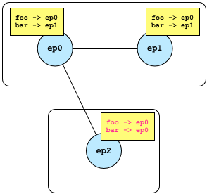

.. _communication:

Communication
=============

Broker's primary objective is to facilitate efficient communication through a
publish/subscribe model. In this model, entities send data by publishing to a
specific topic, and receive data by subscribing to a topic of interest. The
asynchronous nature of publish/subscribe makes it a popular choice for loosely
coupled, distributed systems.

Broker is the successor of `Broccoli
<https://www.bro.org/sphinx/components/broccoli/broccoli-manual.html>`_, Bro's
client communications library. Broccoli enables arbitrary applications to
communicate in Bro's data model.

Endpoints
---------

Broker encapsulates its entire state in a ``context`` object. Multiple
instances of a ``context`` can exist in the same process, but each ``context``
features a thread-pool and (configurable) scheduler, which determines the
execution of Broker's components. Using a single ``context`` per OS process
guarantees the most efficient usage of available hardware resources.
Nonetheless, multiple Broker applications can seamlessly operate when linked
together, as there exists no global library state.

A ``context`` can *spawn* ``endpoint`` instances, of which there exists a
*blocking* and *non-blocking* variant. The two types differ in the way they
manage their subscriptions and receive messages. Both variants have a
*mailbox*, which is essentially a queue with its unprocessed messages. In the
blocking case, the user manually extracts messages from the mailbox, whereas
the Broker runtime dispatches messages asynchronously in the non-blocking case.

Both endpoint variants can be mixed and matched, it is not necessary to commit
to a particular type for all endpoints within a context.

.. note::

  Instances of type ``endpoint`` have reference semantics: that is, they behave
  like a reference in that it's impossible to obtain an invalid one (unlike a
  null pointer). An ``endpoint`` can also be copied around cheaply, but is not
  thread-safe.

Receiving Data
~~~~~~~~~~~~~~

Endpoints can receive data through an explicit call to ``receive`` (blocking
API) or installing a callback invoked by the runtime (non-blocking API).

Blocking
********

The blocking API exists for applications that primarily operate synchronously
and/or ship their own event loop. Endpoints subscribe to various topics and
call a ``receive`` function to block and wait for message:

.. code-block:: cpp

  context ctx;
  auto ep = ctx.spawn<blocking>();
  ep.subscribe("foo");
  auto msg = ep.receive(); // block and wait until a message arrives
  std::cout << msg.topic() << " -> " << msg.data() << std::endl;

There exists also an overload of ``receive`` that takes a callback, but is
semantically otherwise equivalent:

.. code-block:: cpp

  // block and wait until a message arrives
  ep.receive(
    [&](const topic& t, const data& d) {
      std::cout << msg.topic() << " -> " << msg.data() << std::endl;
    }
  );

Because ``receive`` may block forever, blocking endpoints also expose a simple
interface to their mailbox:

.. code-block:: cpp

  if (!ep.mailbox().empty()) {
    // guaranteed to not block
    auto msg = ep.receive();
    ...
  }

Alternatively, the mailbox exposes a file descriptor that indicates
"readiness," i.e., whether a message sits in the mailbox and can be processed
without blocking:

.. code-block:: cpp

  auto fd = ep.mailbox().descriptor();
  // use descriptor in existing poll/select loop
  ::pollfd p = {fd, POLLIN, {}};
  auto n = ::poll(&p, 1, timeout);
  if (n < 0)
    std::terminate(); // poll failed
  if (n == 1 && p.revents & POLLIN;)
    // guaranteed to not block
    auto msg = ep.receive();

Non-Blocking
************

If your application does not require the synchronous API, the non-blocking API
offers an asynchronous alternative. Unlike the blocking API, non-blocking
endpoints take a callback for each topic they subscribe to:

.. code-block:: cpp

  context ctx;
  auto ep = ctx.spawn<nonblocking>();
  ep.subscribe("/foo", [=](const topic& t, const data& d) {
    std::cout << t << " -> " << d << std::endl;
  });
  ep.subscribe("/bar", [=](const topic& t, const data& d) {
    std::cout << t << " -> " << d << std::endl;
  });

When a new message matching the subscription arrives, Broker dispatches it to
the callback without blocking.

.. warning::

  The function ``subscribe`` returns immediately. Capturing variable *by
  reference* introduces a dangling reference once the outer frame returns.
  Therefore, only capture locals *by value*.

Sending Data
~~~~~~~~~~~~

The API for sending data is the same for blocking and non-blocking endpoints.
In Broker, a *message* is a *topic*-*data* pair. That is, endpoints *publish*
data under a *topic* to send a message to all subscribers:

.. code-block:: cpp

  ep.publish("foo", 42);
  ep.publish("bar", vector{1, 2, 3});
  ep.publish("baz", 1, 2, 3); // same as above, implicit conversion to vector

The one-argument version of ``publish`` takes as first argument a ``topic`` and
``data`` instance. The variadic version implicitly constructs a ``vector`` from
the provided ``data`` instances.

.. note::

  Publishing a message can be no-op if there exists no subscriber. Because
  Broker has fire-and-forget messaging semantics, the runtime does not generate
  a notification if no subscribers exist.

See :ref:`data-model` for a detailed discussion on how to construct various
types of ``data``.

Peerings
--------

In order to publish messages beyond the sending endpoint, an endpoint needs to
peer with other endpoints. A peering is a bidirectional relationship between
two endpoints. Peering endpoints exchange subscriptions and forward messages
accordingly. This allows for creating flexible communication topologies that
use topic-based message routing.

.. note::

  Broker currently does not support topologies with loops. This is purely a
  technical limitation and vanishes in the future.

An endpoint can either peer with a local or a remote endpoint:

.. code-block:: cpp

  context ctx;
  auto ep0 = ctx.spawn<blocking>();
  ep0.subscribe("foo");
  auto ep1 = ctx.spawn<nonblocking>();
  ep0.peer(ep1); // exchanges existing subscriptions
  ep1.subscribe("bar"); // relays subscription to peers

The figure below shows the subscription before and after entering the peering
relationship.

.. image:: _images/peering-1.png
  :align: center

Let's consider a third endpoint joining, this time through a remote connection.

.. code-block:: cpp

  // Expose endpoint at an IP address and TCP port.
  ep0.listen(1.2.3.4, 40000);

  // In a separate OS process, connect to it.
  context ctx;
  auto ep2 = ctx.spawn<nonblocking>();
  ep2.peer(1.2.3.4, 42000); // installs a remote peering

Thereafter, we have the following topology:

Note that ``ep2`` does not know about ``ep1`` and forwards ``data`` for topic
``foo`` and ``bar`` via ``ep0``. However, ``ep2.publish("bar", 42)`` still
forwards a message via ``ep0`` to ``ep1``.

Status Messages
---------------

In an asynchronous and distributed system, failures become the norm rather than
constitute an exception. Endpoints may crash or the network experience an
outage. While Broker cannot prevent these events from happening, it can detect
them. To this end, there exists a special ``status`` message, which endpoints
can subscribe to in addition to regular data messages.

For example, when a new peering relationship gets estalbished, both endpoints
receive ``peer_added`` status message:

.. code-block:: cpp

  context ctx;
  auto ep0 = ctx.spawn<blocking>();
  auto ep1 = ctx.spawn<blocking>();
  ep0.receive(
    [&](const status& s) { BROKER_ASSERT(s == peer_added); }
  );
  ep1.receive(
    [&](const status& s) { BROKER_ASSERT(s == peer_added); }
  );

For blocking endpoints, status messages accumulate along with data messages. It
is the user's responsibility to extract status messages from the mailbox to
prevent it from overflowing.

For nonblocking endpoints, status message get ignored unless subscribing to
them explicitly:

.. code-block:: cpp

  context ctx;
  auto ep = ctx.spawn<nonblocking>();
  ep.subscribe(
    [&](const status& s) { log(s); }
  );
