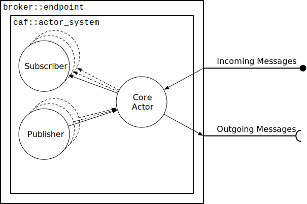
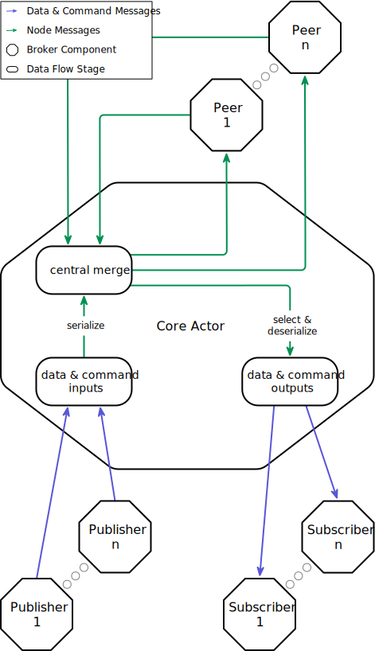

.. _devs:

Developer Guide
===============

Broker is based on the `CAF, the C++ Actor Framework
<http://www.actor-framework.org>`_. Experience with CAF certainly helps, but a
basic understanding of the actor model as well as publish/subscribe suffices for
understanding (and contributing to) Broker.

In the code base of Broker, we frequently use templates, lambdas, and common C++
idioms such as CRTP and RAII.

Architecture
------------

From a user perspective, the Broker endpoint is the  primary component in the
API (see :ref:`endpoint`). Internally, an endoint is a container for an actor
system that hosts the *core actor* plus any number of *subscribers* and
*publishers*. The figure below shows a simplified architecture of Broker in
terms of actors.

An endpoint always contains exactly one core actor. From the perspective of the
implementation, this actor is the primary component. It manages publishers and
subscribers, maintains peering relations, forwards messages to remote peers,
etc.

Broker uses four types of messages internally, whereas a message here simply
means a *copy-on-write* (COW) tuple.

1. A *data message* consists of a *topic* and user-defined *data* (cf.
   :ref:`Data Model <data-model>`). Any direct user interaction on publishers or
   subscribers uses this message type internally.

2. A *command message* consists of a *topic* and a private data type called
   ``internal_command``. This type of message usually remains hidden to Broker
   users since this message type represents internal communication of :ref:`data
   stores <data-stores>` (between masters and clones).

3. A *packed message* represents a data, command, or routing-related  message in
   a serialized form. Each packed message consists of a type tag, a TTL field, a
   topic, and a byte buffer. The type tag stores the type information needed to
   deserialize the byte buffer. The TTL field is a counter that decrements
   whenever Broker forwards a message between peers. Once the counter reaches
   zero, Broker no longer forwards the message.

4. A *node message* represents a message between two Broker nodes (endpoints).
   The routing and dispatching logic in the core actor operates on this message
   type. Node messages are tuples that consist of two endpoint IDs, one for the
   sender and one for the receiver, as well as a packed message that represents
   the actual content.

Broker organizes those message types in *data flows*, as depicted below:

The core actor represents the main hub that connects local and remote flows. In
general, publishers generate data for peers and subscribers consume data from
peers. In the core actor, there is a central merge point where all messages flow
though. Peers directly tap into this dispatching point. Since peers operate on
node messages, they do not need to serialize or deserialize any payloads when
writing to or reading from the network. The core actor selects all messages with
local subscriptions from the central merge point and only deserializes node
messages into data or command messages once.

Likewise, incoming messages from publishers get serialized once immediately
after receiving them and then they flow as node messages into the central merge
point.

Implementation
--------------

Endpoints, master stores, and clone stores (see :ref:`overview`) all map to
actors. Endpoints wrap the `actor system`_ and the main component: the core
actor (see architecture_).

The Core Actor
~~~~~~~~~~~~~~

As the name suggests, this actor embodies the central hub for the
publish/subscribe communication. Everything flows through this actor: local
subscriptions, peering requests, local and remote publications, control messages
for the stores, and so on.

The data flow stages shown in the Architecture Section also appear in the source
code. However, in the actual implementation we need to distinguish between data
and command messages since they use different C++ types. Hence, the core actor
primarily
revolves around these member variables:

``data_inputs``
  Merges all inputs from local publishers. We also push data directly into this
  merger when receiving publication messages that bypass the flow abstractions.
  These messages get generated from ``endpoint::publish``. The ``central_merge``
  consumes messages from this merger (after converting each ``data_message`` to
  a ``node_message``).

``command_inputs``
  Merges all inputs from data store actors. Just like ``data_inputs``, we
  convert every incoming message to a ``node_message`` and then feed it into the
  ``central_merge``.

``central_merge``
  Merges inputs from connected peers, local publishers and local data store
  actors. Everything flows through this central point. This makes it easy to tap
  into the message flow of Broker: each new downstream simply filters messages
  of interest and then operates on the selected subset.

``data_outputs``
  This stage makes all data messages that match local subscriptions (and that
  should be visible on this endpoint) available by filtering from the
  ``central_merge`` and deserializing the payloads. Broker initializes this
  stage lazily. As long as no local subscriber appears, Broker does not
  deserialize anything.

``command_outputs``
  Similar to ``data_outputs``, this stage makes command messages available to
  local data store actors. We also construct this member lazily.

New peers are modeled as a pair of flows: one for incoming node messages and one
for outgoing node messages. The peers themselves are trivially implemented.
We receive a connected socket from the connector after a successful peering
handshake. We hand this socket over to a CAF socket manager that translates from
the data flows to socket reads and writes. All we need in addition to the flow
management is a trait class that informs CAF how to serialize and deserialize
the data.

The core actor also emits messages for peering-related events that users can
consume with status subscribers. For the peering-related events, the core actor
implements the following callbacks that also make it easy to add additional
logic to any of those events:

- ``peer_discovered``
- ``peer_connected``
- ``peer_disconnected``
- ``peer_removed``
- ``peer_unreachable``
- ``cannot_remove_peer``
- ``peer_unavailable``

Handshakes
**********

Handshakes are performed by the *connector*. The core actor implements a
listener interface to enable it to receive connected sockets after successful
handshakes.

Broker uses a three-way handshake to make sure there is always exactly at most
one connection between two peers. Each Broker endpoint has a unique ID (a
randomly generated UUID). After establishing a TCP connection, Broker peers send
a ``hello`` message with their own endpoint ID. By convention, the endpoint with
the *smaller* ID becomes the originator. The example below depicts all handshake
messages with two nodes, Peer A (establishes the TCP connection) and Peer B (has
a smaller ID than A).

.. code-block:: none

           +-------------+                    +-------------+
           |   Peer A    |                    |   Peer B    |
           +------+------+                    +------+------+
                  |                                  |
   endpoint::peer |                                  |
  +-------------->+                                  |
                  |                                  |
                  +---+                              |
                  |   | try to connect via TCP       |
                  +<--+                              |
                  |                                  |
                  | (hello)                          |
                  +--------------------------------->+
                  |                                  |
                  |                 (originator_syn) |
                  +<---------------------------------+
                  |                                  |
                  | (responder_syn_ack)              |
                  +--------------------------------->+
                  |                                  |
                  |               (originator_ack)   |
                  +<---------------------------------+
                  |                                  |
                  |                                  |

Peers abort handshakes with ``drop_conn`` messages when detecting redundant
connections.

Logical Time
------------

Broker has two types for modelling logical clocks:

#. ``broker::lamport_timestamp``
#. ``broker::vector_timestamp``

The former type is a thin wrapper (AKA *strong typedef*) for a 64-bit unsigned
integer. It provides ``operator++`` as well as the comparison operators.

.. _devs.channels:

Channels
--------

Channels model logical connections between one *producer* and any number of
*consumers* on top of an unreliable transport. Changes in the topology of Broker
at runtime can cause reordering of messages if a faster path appears or loss of
messages if a path disappears.

In places where Broker requires ordered and reliable communication, e.g.,
communication between clone and master actors, the class
``broker::internal::channel`` provides a building block to add ordering and
reliability.

A channel is unaware of the underlying transport and leaves the rendezvous
process (i.e., how producers learn handles of new consumers) to the user. The
class ``channel`` defines message types as well as interfaces for ``producer``
and ``consumer`` implementations (both use CRTP to interface with user code).

Producer
~~~~~~~~

The producer requires a ``Backend`` template parameter and expects a pointer of
type ``Backend*`` in its constructor. This backend implements a transport layer
for the channel and must provide the following interface (pseudo code):

.. code-block:: cpp

  interface Backend {
    // Sends a unicast message to `hdl`.
    void send(producer*, const Handle& hdl, const T& msg);

    // Sends a multicast message to all consumers.
    void broadcast(producer*, const T& msg)

    // Called to indicate that a consumer got removed by the producer.
    void drop(producer*, const Handle& hdl, ec reason)

    // Called to indicate that the producer received the initial ACK.
    void handshake_completed(producer*, const Handle& hdl)
  };

The first argument is always the ``this`` pointer of the producer. This enables
the backend to multiplex more than one producer at a time. The type ``Handle``
identifies a single consumer. In the data store actors, this is an
``entity_id``. Finally, ``T`` is one of the following message types:

+-----------------------+----------------------------------------------------+
| Type                  | Semantics                                          |
+=======================+====================================================+
| ``handshake``         | Transmits the first sequence number to a consumer. |
+-----------------------+----------------------------------------------------+
| ``event``             | Transmits ordered data to consumers.               |
+-----------------------+----------------------------------------------------+
| ``retransmit_failed`` | Notifies that an event is no longer available.     |
+-----------------------+----------------------------------------------------+
| ``heartbeat``         | Keeps connections to consumers alive.              |
+-----------------------+----------------------------------------------------+

Consumer
~~~~~~~~

Similar to the producer, the consumer also requires a ``Backend`` for providing
a transport and consuming incoming events (pseudo code):

.. code-block:: cpp

  interface Backend {
    // process a single event.
    void consume(consumer*, Payload)

    // Sends a control message to the producer.
    void send(consumer*, T)`

    // Process a lost event. The callback may abort further processing by
    // returning a non-default error. In this case, the consumer immediately
    // calls `close` with the returned error.
    error consume_nil(consumer*)

    // Drops this consumer. After calling this function, no further function
    // calls on the consumer are allowed (except calling the destructor).
    void close(consumer*, error)
  };

The first argument is always the ``this`` pointer of the consumer. This enables
the backend to multiplex more than one consumer at a time. The member function
``send`` always implicitly transmits control messages to the single producer.
The type ``Payload`` is a template parameter of ``channel`` and denotes the
content of ``event`` messages of the producer. Finally, ``T`` is one of the
following message types:

+--------------------+----------------------------------------------------+
| Type               | Semantics                                          |
+====================+====================================================+
| ``cumulative_ack`` | Notifies the producer which events were processed. |
+--------------------+----------------------------------------------------+
| ``nack``           | Notifies the producer that events got lost.        |
+--------------------+----------------------------------------------------+

Consumers send ``cumulative_ack`` messages periodically, even if no messages
were received. This enables the producer to keep track of which consumers are
still alive and reachable.

Channels in Data Store Actors
-----------------------------

In general, the master actor broadcasts state updates to its clones. This maps
directly to the one-producer-many-consumers model of ``channel``. However,
clones can also take the role a producer when forwarding mutating operations to
the master.

In a nutshell, the master actor (see ``master_actor.hh``) always has a producer
attached to it and any number of consumers:

.. code-block:: cpp

  using producer_type = channel_type::producer<master_state>;

  using consumer_type = channel_type::consumer<master_state>;

  producer_type output;

  std::unordered_map<entity_id, consumer_type> inputs;

Conversely, the clone actor (see ``clone_actor.hh``) always has a consumer
attached to it and it *may* have a producer:

.. code-block:: cpp

  using consumer_type = channel_type::consumer<clone_state>;

  using producer_type = channel_type::producer<clone_state, producer_base>;

  consumer_type input;

  std::unique_ptr<producer_type> output_ptr;

Clones initialize the field ``output_ptr`` lazily on the first mutating
operation they need to forward to the master.

Mapping Channel to Command Messages
~~~~~~~~~~~~~~~~~~~~~~~~~~~~~~~~~~~

The message types defined in ``channel`` are never used for actor-to-actor
communication directly. Instead, masters and clones exchange ``command_message``
objects, which consist of a ``topic`` and an ``internal_command`` (the
``Payload`` type for the channels). Masters and clones convert between Broker
message types and channel message types on the fly (using a surjective mapping).
The essential interface for ``internal_command`` is defined as follows:

.. code-block:: cpp

  enum class command_tag {
    action,
    producer_control,
    consumer_control,
  };

  class internal_command {
  public:
    // ...
    using variant_type
      = std::variant<put_command, put_unique_command, put_unique_result_command,
                     erase_command, expire_command, add_command, subtract_command,
                     clear_command, attach_writer_command, keepalive_command,
                     cumulative_ack_command, nack_command, ack_clone_command,
                     retransmit_failed_command>;

    sequence_number_type seq;

    entity_id sender;

    variant_type content;
  };

  command_tag tag_of(const internal_command& cmd);

Furthermore, data store actors define ``channel_type`` as
``channel<entity_id, internal_command>``. When processing an
``internal_command``, the receiver first looks at the tag.

Control messages directly map to channel messages:

+-----------------------------------+-----------------------------------+
| Internal Command Type             | Channel Message Type              |
+===================================+===================================+
| ``attach_writer_command``         | ``channel::handshake``            |
+-----------------------------------+-----------------------------------+
| ``ack_clone_command``             | ``channel::handshake``            |
+-----------------------------------+-----------------------------------+
| ``cumulative_ack_command``        | ``channel::cumulative_ack``       |
+-----------------------------------+-----------------------------------+
| ``nack_command``                  | ``channel::nack``                 |
+-----------------------------------+-----------------------------------+
| ``keepalive_command``             | ``channel::heartbeat``            |
+-----------------------------------+-----------------------------------+
| ``retransmit_failed_command``     | ``channel::retransmit_failed``    |
+-----------------------------------+-----------------------------------+

When a clone adds a writer, it sends an ``attach_writer_command`` handshake.

All internal commands that contain an *action*,
such as ``put_comand``, get forwarded to the channel as payload. Either by
calling ``produce`` on a ``producer`` or by calling ``handle_event`` on a
consumer. The latter then calls ``consume`` on the data store actor with the
``internal_command`` messages in the order defined by the sequence number.

Cluster Setup and Testing
-------------------------

Peering, path discovery, subscription propagation, etc. takes some unspecified
amount of time when setting up a cluster. If a single manager is responsible for
this setup, the work flow usually relies on some feedback to the manager to
signal when the cluster is fully connected and ready to use. The same applies
when writing high-level integration tests.

In order to wait for two nodes to add each other their routing tables and
exchange subscriptions, the class ``endpoint`` provides the member function
``await_peer``:

.. literalinclude:: ../include/broker/endpoint.hh
   :language: cpp
   :start-after: --await-peer-start
   :end-before: --await-peer-end

The first overload blocks the caller, until a timeout (or error) occurs or the
awaited peer has connected. The second overload is an asynchronous version that
takes a callback instead. On success, the endpoint calls the callback with
``true`` and otherwise it calls the callback with ``false``.

To retrieve the ``entity_id`` from an ``endpoint`` object, simply call
``node_id()``. For example, if both endpoints belong to the same process:

.. code-block:: cpp

  endpoint ep0;
  endpoint ep1;
  // ... call listen and peer ...
  ep0.await_peer(ep1.node_id());
  ep1.await_peer(ep0.node_id());

Note that ``ep0.await_peer(...)`` only confirms that  ``ep0`` has a path to the
other endpoint and received a list of subscribed topics. To confirm a mutual
relation, always call ``await_peer`` on both endpoints.

The Python bindings also expose the blocking overload of ``await_peer``. For
example, connecting three endpoints with data stores attached to them in a unit
test can follow this recipe:

.. literalinclude:: ../tests/python/store.py
   :language: python
   :start-after: --tri-setup-start
   :end-before: --tri-setup-end

.. note::

  When setting up a cluster, make sure to add subscribers (and data stores)
  *before* establishing the peering relations. Otherwise, the subscriptions get
  flooded after all connections have been established. This means any
  broadcasted event that arrives before the subscriptions gets lost.

Data Stores
~~~~~~~~~~~

When working with data stores, the member function ``store::await_idle`` allows
establishing a predefined order:

.. literalinclude:: ../include/broker/store.hh
   :language: cpp
   :start-after: --await-idle-start
   :end-before: --await-idle-end

What *idle* means depends on the role:

For a *master*, idle means the following:
  - There are no pending handshakes to clones.
  - All clones have ACKed the latest command.
  - All input buffers are empty, i.e., there exists no buffered command from a
    writer.

For a *clone*, idle means the following:
  - The clone successfully connected to the master.
  - The input buffer is empty, i.e., there exists no buffered command from the
    master.
  - All local writes (if any) have been ACKed by the master.

Just like ``await_peer``, calling ``await_idle`` on only one ``store`` object
usually does not guarantee the desired state. For example, consider a setup with
one master (``m``) and three clones (``c0``, ``c1``, and ``c2``). When calling
``put`` on ``c0``, ``await_idle`` would return after ``m`` has ACKed that it
received the ``put`` command. At this point, ``c1`` and ``c2`` might not yet
have seen the command. Hence, the process must also call ``await_idle`` on the
master before it make the assumption that all data stores are in sync:

.. code-block:: cpp

  c0.put("foo", "bar");
  if (!c0.await_idle()) {
    // ... handle timeout ...
  }
  if (!m.await_idle()) {
    // ... handle timeout ...
  }

.. note::

  In the example above, calling ``await_idle`` on ``c1`` and ``c2`` as well is
  *not* necessary. The master enters the *idle* mode after all clones have ACKed
  the latest command.

.. _actor system: https://actor-framework.readthedocs.io/en/stable/Actors.html#environment-actor-systems
.. |alm::stream_transport| replace:: ``alm::stream_transport``
.. |alm::peer| replace:: ``alm::peer``
.. _stream manager: http://actor-framework.org/doc/classcaf_1_1stream__manager.html
.. _broker-cluster-benchmark: https://github.com/zeek/broker/tree/master/tests/benchmark#clustering-broker-cluster-benchmark
