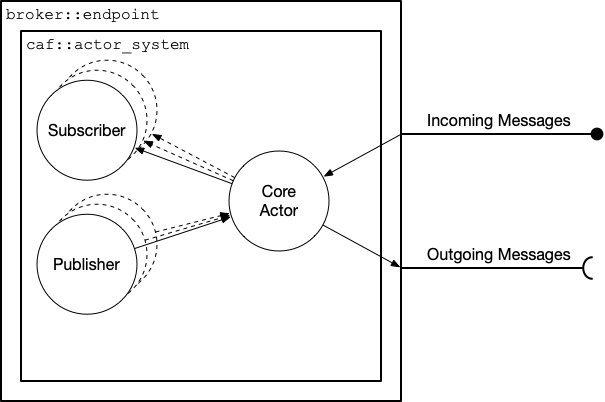
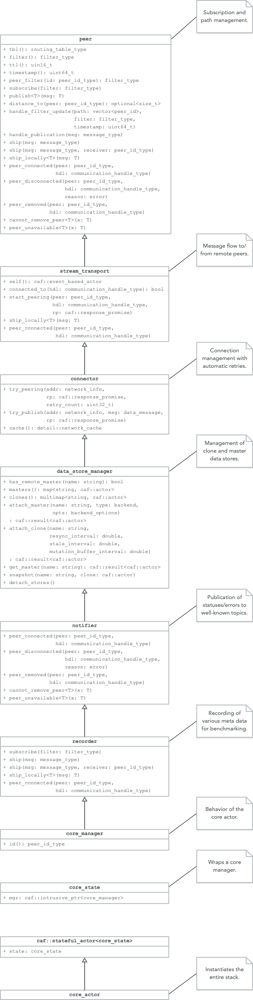

.. _devs:

Developer Guide
===============

Broker is based on the `C++ Actor Framework (CAF)
<http://www.actor-framework.org>`_. Experience with CAF certainly helps, but a
basic understanding of the actor model as well as publish/subscribe suffices for
understanding (and contributing to) Broker.

In the code base of Broker, we frequently use templates, lambdas, mixins (static
polymorphism), etc. as well as common C++ idioms such as CRTP and RAII.
Developers should bring *at least* advanced C++ skills.

Architecture
------------

From a user perspective, a Broker endpoint is the  primary component in the API
(see :ref:`endpoint`). Internally, an endoint is a container for an actor system
that hosts the *core actor* plus any number of *subscribers* and *publishers*.
The figure below shows a simplified architecture of Broker in terms of actors.

A Broker endpoint always contains exactly one core actor. From the perspective
of the implementation, this actor is the primary component. It manages
publishers and subscribers, establishes peering relations, forwards messages to
remote peers, etc.

Because the core actor has many roles to fill, its implementation spreads
severall classes. The following UML class diagram shows all classes involved in
implementing the core actor with an exempt of the relevant member functions.

In a distributed setting, each core actor represents one *peer*.

Multi-Hop Routing / Application-Layer Multicast (ALM)
-----------------------------------------------------

Broker follows a peer-to-peer (P2P) approach in order to make setting up and
running a cluster convenient and straightforward for users. At the same time, we
wish to avoid "too much magic". Ultimately, want the users to decide the
topology that best fits their deployment.

Theoretically, IP multicast offers the most efficient option for publishing
events. However, IP multicast implements neither reliability nor encryption by
default. Further, IP multicast is not routed in the Internet. Extensions for
reliability and security exist, but we cannot rely on Broker users to provide
this infrastructure. To run "out of the box", we rely on TCP connections only
and minimize message duplication via ALM.

Goals
  - Connections are secured/authenticated through TLS & certificates.
  - Broker puts no constraints on topologies, i.e., users may establish all
    peering relations that make sense in their deployment without having to
    form a tree. Loops are explicitly allowed.
  - Broker detects (and slows down) any publisher that produces data at a faster
    rate than the subscribers or the network can handle.
  - Each peer can publish to each topic. No central coordinator or root node
    exists.
  - Broker minimizes messages in the network with (application-layer) multicast
    in order to scale effectively.

Non-Goals
  - Dynamic connection management and auto-balancing of a distribution tree.
    While Broker generally follows a P2P philosophy, we still wish to give users
    full control over Broker's topology. Also, Broker does not target
    Internet-wide deployments with very high churn rates and unreliable nodes.

Peers
~~~~~

Each Broker peer in the network has:

- A globally unique ID. Currently, we use ``caf::node_id`` to identify peers.
  CAF computes this ID automatically by combining a 160-bit hash value (based on
  a seed plus various node-specific information) with the OS-specific process
  ID.
- A filter for incoming messages. The core actor combines the filters of all
  subscribers running in the endpoint to a single filter. The core actor removes
  all redundant entries. For example, if the user starts subscribers with the
  filters ``[/zeek/event/foo]``, ``[/zeek/event/bar]``, and ``[/zeek/event]``,
  then core actor combines these three filters to ``[/zeek/event]``. Due to the
  prefix matching, this one entry implicitly includes ``/zeek/event/foo`` and
  ``/zeek/event/bar``. When distributing incoming messages to subscribers, each
  individual subscriber of course only receives messages that match its filter.
- A logical clock (`Lamport timestamps
  <https://en.wikipedia.org/wiki/Lamport_timestamps>`_). This 64-bit integer
  enables detection of repeated messages and ordering of events. Whenever a peer
  sends a message to others, it increments its logical time and includes the
  current value in the message. This timestamp is crucial for detecting outdated
  or repeated subscriptions in the `Subscription Flooding`_.
- A routing table with paths to *all* known peers in the network.
- A ``peer_filters_`` map of type ``map<peer_id_type, filter_type>`` for storing
  the current filter of each known peer.

Timestamps
~~~~~~~~~~

Broker has two types for modelling logical clocks:

#. ``broker::alm::lamport_timestamp``
#. ``broker::alm::vector_timestamp``

The former type is a thin wrapper (AKA *strong typedef*) for a 64-bit unsigned
integer. It provides ``operator++`` as well as the comparison operators. Each
peer keeps its own Lamport timestamp. The peer increments the timestamp whenever
it changes its routing table or its filter.

The latter type is a list of ``lamport_timestamp``. Broker uses vector
timestamps to versionize paths.

Routing Tables
~~~~~~~~~~~~~~

A routing table maps peer IDs to versioned paths. Conceptually, the routing
table maps each peer to a set of paths that lead to it.

.. code-block:: C++

  using path = std::vector<peer_id>;
  using versioned_paths = std::map<path, vector_timestamp>;
  using routing_table = std::map<peer_id, versioned_paths>;

.. note::

  The actual implementation of the routing table is slightly more complex, since
  it also maps the peer IDs to communication handles (needed by CAF for message
  passing).

Source Routing
~~~~~~~~~~~~~~

Broker uses source routing. Messages between peers contain the forwarding path,
encoded as an ``alm::multipath`` object.

The ``multipath`` class implements a recursive data structure for encoding
branching paths (directed acyclic graphs). For example:

.. code-block:: text

  A ────> B ─┬──> C
             └──> D ────> E

In this scenario, A sends a message to B, which then forwards to C and D. After
receiving the message, D also forward to E. This gives senders full control over
the path that a message travels in the network.

Furthermore, a message also contains IDs of receivers. Not every peer that
receives a message subscribed to its content. Hence, peers that are not in the
list of receivers only forward the message without inspecting the payload.

Subscription Flooding
~~~~~~~~~~~~~~~~~~~~~

Whenever the filter of a peer changes, it sends a *subscription* message to all
peers it has a direct connection to (neighbors). When establishing a new
peering relation, the handshake also includes the *subscription* message.

The subscription message consists of:

#. A ``peer_id_list`` for storing the path of this message. Initially, this list
   only contains the ID of the sender.
#. The ``filter`` for selecting messages. A node only receives messages for
   topics that pass its filter (prefix matching).
#. A 64-bit (unsigned) timestamp. This is the logical time of the sender for
   this event.

Whenever receiving a *subscription* message (this ultimately calls
``handle_filter_update`` in ``include/broker/alm/peer.hh``), a peer first checks
whether the path already contains its ID, in which case it discards the message
since it contains a loop.

If a peer sees the sender (the first entry in the path) for the first time, it
stores the filter in its ``peer_filters_`` map and the new path in its routing
table. Otherwise, it checks the timestamp of the message:

- If the timestamp is *less* than the last timestamp, a peer simply drops the
  outdated message.
- If the timestamp is *equal* to the last timestamp, a peer checks whether the
  message contains a new path and updates it routing table if necessary. Complex
  topologies can have multiple paths between two peers. The flooding eventually
  reveals all existing paths between two peers.
- If the timestamp is *greater* than the last timestamp, a peer overrides the
  subscription of the sender and stores the path in its routing table if
  necessary.

All messages that were not discarded by this point get forwarded to all direct
connections that are not yet in the path. For that, a peer adds itself to the
path and forwards the message otherwise unchanged (in particular, the timestamp
remains unchanged, since it represent the logical time *of the sender*).

By flooding the subscriptions in this way, Broker is able to detect all possible
paths between nodes. However, this mechanism can cause a high volume of messages
for topologies with many loops that result in a large number of possible paths
between all nodes.

The number of messages generated by the flooding depends on the topology. In a
trivial chain topology of :math:`n` nodes (:math:`n_0` peers with :math:`n_1`,
:math:`n_1` peers with :math:`n_2`, and so on), we generate a total of
:math:`n-1` messages. In a full mesh, however, we generate :math:`(n-1)^2`
messages.

Should we observe severe performance degradations as a result of the flooding,
Broker could limit the maximum path length or select only a limited set of paths
(ideally, this subset should be as distinct as possible).

Publishing Data
~~~~~~~~~~~~~~~

Whenever `the core actor`_ receives data from a local publisher, it scans its
routing table for all nodes subscribed to the topic (prefix matching).

*TODO: implement and discuss source routing.*

Implementation
--------------

Endpoints, master stores, and clone stores (see :ref:`overview`) all map to
actors. Endpoints wrap the `actor system`_ and the main component: the core
actor (see architecture_). The core actor is implemented using the mixins we
discuss in this section.

Mixins
~~~~~~

Mixins (cf. `Wikipedia:Mixin <https://en.wikipedia.org/wiki/Mixin>`_) allow
Broker to implement static polymorphism while also avoiding multiple
inheritance. In a nutshell, this means we use *function hiding* (as opposed to
*function overriding* of ``virtual`` member functions) for adding or altering
functionality of functions. Rather than using *pure virtual* member functions in
base types, we use CRTP to call member function on the derived type.

Mixins usually follow this scaffold:

.. code-block:: C++

  template <class Base, class Subtype>
  class my_mixin : public Base {
  public:

    using super = Base;

    using extended_base = my_mixin;

    // ... implementation ...

  private:
    auto& dref() {
      return *static_cast<Subtype*>(this);
    }

    // ... more implementation ...
  };

By using exactly two template parameters in the order shown above as well as
defining ``extended_base``, we can use CAF's ``extend`` utility:

.. code-block:: C++

  class my_class : public caf::extend<my_base, my_class>::with<M1, M2, M3> {
    // ...
  };

In the example above, ``my_base`` is the base type of our inheritance graph.
``M1``, ``M2`` and ``M3`` are mixins. The final inheritance graph is
``my_class`` → ``M1`` → ``M2`` → ``M3`` → ``my_base`` (where A → B means *A
inherits from B*).

CAF's ``extend`` is of course just syntactic sugar for:

.. code-block:: C++

  class my_class : public M1<M2<M3<my_base, my_class>, my_class>, my_class> {
    // ...
  };

Lifting
~~~~~~~

Broker has a small utility called ``detail::lift`` (implemented in
``broker/detail/lift.hh``) for lifting member functions into message handlers
(callbacks). It's sole purpose is to avoid writing repeated lambda expressions
that only wrap member function calls. Consider this small example:

.. code-block:: C++

  struct calculator {
    int add(int x, int y) const noexcept { return x + y; }

    int sub(int x, int y) const noexcept { return x - y; }

    // ...

    caf::behavior make_behavior() {
      using detail::lift;
      return {
        lift<atom::add>(*this, calculator::add),
        lift<atom::sub>(*this, calculator::sub),
      };
    }
  };

By using ``lift``, we avoid repeating the arguments over and over again in
``make_behavior``. The implementation is equivalent to writing:

.. code-block:: C++

  caf::behavior make_behavior() {
    return {
      [this](atom::add, int x, int y) { return add(x, y); },
      [this](atom::sub, int x, int y) { return sub(x, y); },
    };
  }

We can pass any number of template parameters to ``lift`` for prefixing the
message with atoms or leave the pack empty to dispatch on the member function
signature only.

Note: lifting overloaded member functions does not work in this concise syntax.
In order to tell the compiler *which* overload to pick, we need to either store
the member function pointer in a properly typed variable first or use
``static_cast``.

The Core Actor
~~~~~~~~~~~~~~

As the name suggests, this actor embodies the central hub for the
publish/subscribe communication. Everything flows through this actor: local
subscriptions, peering requests, local and remote publications, control messages
for the stores, and so on. However, you might be surprised when looking at
``core_actor.cc``, as it contains barely any code. Exactly because the core
actor has so many roles to fill, we have separated it into many functional
blocks. Most blocks are implemented as mixins_ in order to make each functional
block testable and reusable while avoiding runtime costs for the decoupling.

``alm::peer``
*************

This class models a Broker peer in the network. It implements the management of
subscriptions, maintains a routing table for sending data to peers, and provides
callbacks for its subtypes.

The callback are:

- ``ship_locally``
- ``peer_connected``
- ``peer_disconnected``
- ``peer_removed``
- ``cannot_remove_peer``
- ``peer_unavailable``

Please refer to the Doxygen documentation for a detailed explanation as well as
parameters. The important thing to note is that the peer allows extending its
basic functionality by extending the callbacks. Also note that we use static
polymorphism. Any subtype that wishes to extend functionality of the peer
*hides* the function of its base type and calls the implementation of its base
type in the function body.

For example, the following code shows how the ``notifier`` extends the
``peer_connected`` callback:

.. code-block:: C++

  void peer_connected(const peer_id_type& peer_id,
                      const communication_handle_type& hdl) {
    BROKER_TRACE(BROKER_ARG(peer_id) << BROKER_ARG(hdl));
    emit(peer_id, sc::peer_added, "handshake successful");
    super::peer_connected(peer_id, hdl);
  }

The ``peer`` is implemented at as template not only because of CRTP, but also to
allow Broker to configure the types used for the global ID (``PeerId``) and for
communication handles to other peers (``CommunicationHandle``). The core actor
sets ``PeerId = caf::node_id`` and ``CommunicationHandle = caf::actor``.
However, some unit tests use different template parameters.

The member function ``ship`` implements `publishing data`_, but the class
``peer`` has no code for actually sending messages. The peer leaves this to its
derived types and requires that ``dref().send(...)`` is well-formed. The core
actor uses a |alm::stream_transport|_ as communication backend for the
peer.

Most functions in the ``peer`` are straightforward, but one member function in
particular is worth discussing:

.. code-block:: C++

  template <class... Fs>
  caf::behavior make_behavior(Fs... fs)

This member function returns the behavior for initializing the actor that
implements the peer, i.e., the core actor (leaving unit tests aside). A behavior
is a set of message handlers (callbacks), usually lambda expressions or `lifted
member functions <Lifting_>`_. Each class or `mixin <Mixins_>`_ in the
inheritance graph can add additional message handlers to the actor. Each mixin
in the "chain" that registers additional message handlers implements
``make_behavior`` with this exact signature. The template parameter pack
``fs...`` are the message handler registered by a subtype. Each mixin forwards
this pack to its base type along with its own handlers.

Each class should document the message handlers it adds to the actor. The sum of
all message handlers defines the messaging interface of the core actor.

``alm::stream_transport``
*************************

This class implements a communication backend for |alm::peer|_ that connects two
actors by using two CAF stream paths (one for each direction, because paths are
unidirectional).

The stream transport is a CAF `stream manager`_, i.e., it inherits from
``caf::stream_manager``.

.. _actor system: https://actor-framework.readthedocs.io/en/stable/Actors.html#environment-actor-systems
.. |alm::stream_transport| replace:: ``alm::stream_transport``
.. |alm::peer| replace:: ``alm::peer``
.. _stream manager: http://actor-framework.org/doc/classcaf_1_1stream__manager.html
