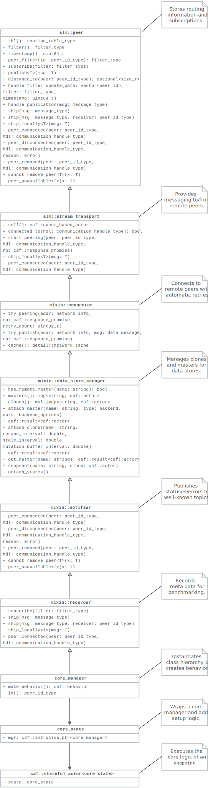

.. _devs:

Developer Guide
===============

Broker is based on the `C++ Actor Framework (CAF)
<http://www.actor-framework.org>`_. Experience with CAF certainly helps, but a
basic understanding of the actor model as well as publish/subscribe suffices for
understanding (and contributing to) Broker.

In the code base of Broker, we frequently use templates, lambdas, mixins (static
polymorphism), etc. as well as common C++ idioms such as CRTP and RAII.
Developers should bring *at least* advanced C++ skills.

Architecture
------------

From a user perspective, a Broker endpoint is the  primary component in the API
(see :ref:`endpoint`). Internally, an endoint is a container for an actor system
that hosts the *core actor* plus any number of *subscribers* and *publishers*.
The figure below shows a simplified architecture of Broker in terms of actors.

.. figure:: _images/endpoint.svg
  :align: center
  :alt: Simplified architecture of a Broker endpoint in terms of actors.

A Broker endpoint always contains exactly one core actor. From the perspective
of the implementation, this actor is the primary component. It manages
publishers and subscribers, establishes peering relations, forwards messages to
remote peers, etc.

Because the core actor has many roles to fill, its implementation spreads
severall classes. The following UML class diagram shows all classes involved in
implementing the core actor with an exempt of the relevant member functions.

In a distributed setting, each core actor represents one *peer*.

Implementation
--------------

Endpoints, master stores, and clone stores (see :ref:`overview`) all map to
actors. Endpoints wrap the `actor system`_ and the main component: the core
actor (see architecture_). The core actor is implemented using the mixins we
discuss in this section.

Mixins
~~~~~~

Mixins (cf. `Wikipedia:Mixin <https://en.wikipedia.org/wiki/Mixin>`_) allow
Broker to implement static polymorphism while also avoiding multiple
inheritance. In a nutshell, this means we use *function hiding* (as opposed to
*function overriding* of ``virtual`` member functions) for adding or altering
functionality of functions. Rather than using *pure virtual* member functions in
base types, we use CRTP to call member function on the derived type.

Mixins usually follow this scaffold:

.. code-block:: C++

  template <class Base, class Subtype>
  class my_mixin : public Base {
  public:

    using super = Base;

    using extended_base = my_mixin;

    // ... implementation ...

  private:
    auto& dref() {
      return *static_cast<Subtype*>(this);
    }

    // ... more implementation ...
  };

By using exactly two template parameters in the order shown above as well as
defining ``extended_base``, we can use CAF's ``extend`` utility:

.. code-block:: C++

  class my_class : public caf::extend<my_base, my_class>::with<M1, M2, M3> {
    // ...
  };

In the example above, ``my_base`` is the base type of our inheritance graph.
``M1``, ``M2`` and ``M3`` are mixins. The final inheritance graph is
``my_class`` → ``M1`` → ``M2`` → ``M3`` → ``my_base`` (where A → B means *A
inherits from B*).

CAF's ``extend`` is of course just syntactic sugar for:

.. code-block:: C++

  class my_class : public M1<M2<M3<my_base, my_class>, my_class>, my_class> {
    // ...
  };

Lifting
~~~~~~~

Broker has a small utility called ``detail::lift`` (implemented in
``broker/detail/lift.hh``) for lifting member functions into message handlers
(callbacks). It's sole purpose is to avoid writing repeated lambda expressions
that only wrap member function calls. Consider this small example:

.. code-block:: C++

  struct calculator {
    int add(int x, int y) const noexcept { return x + y; }

    int sub(int x, int y) const noexcept { return x - y; }

    // ...

    caf::behavior make_behavior() {
      using detail::lift;
      return {
        lift<atom::add>(*this, calculator::add),
        lift<atom::sub>(*this, calculator::sub),
      };
    }
  };

By using ``lift``, we avoid repeating the arguments over and over again in
``make_behavior``. The implementation is equivalent to writing:

.. code-block:: C++

  caf::behavior make_behavior() {
    return {
      [this](atom::add, int x, int y) { return add(x, y); },
      [this](atom::sub, int x, int y) { return sub(x, y); },
    };
  }

We can pass any number of template parameters to ``lift`` for prefixing the
message with atoms or leave the pack empty to dispatch on the member function
signature only.

Note: lifting overloaded member functions does not work in this concise syntax.
In order to tell the compiler *which* overload to pick, we need to either store
the member function pointer in a properly typed variable first or use
``static_cast``.

The Core Actor
~~~~~~~~~~~~~~

As the name suggests, this actor embodies the central hub for the
publish/subscribe communication. Everything flows through this actor: local
subscriptions, peering requests, local and remote publications, control messages
for the stores, and so on. However, you might be surprised when looking at
``core_actor.cc``, as it contains barely any code. Exactly because the core
actor has so many roles to fill, we have separated it into many functional
blocks. Most blocks are implemented as mixins_ in order to make each functional
block testable and reusable while avoiding runtime costs for the decoupling.

``alm::peer``
*************

This class models a Broker peer in the network. It implements the management of
subscriptions, maintains a routing table for sending data to peers, and provides
callbacks for its subtypes.

The callback are:

- ``ship_locally``
- ``peer_connected``
- ``peer_disconnected``
- ``peer_removed``
- ``cannot_remove_peer``
- ``peer_unavailable``

Please refer to the Doxygen documentation for a detailed explanation as well as
parameters. The important thing to note is that the peer allows extending its
basic functionality by extending the callbacks. Also note that we use static
polymorphism. Any subtype that wishes to extend functionality of the peer
*hides* the function of its base type and calls the implementation of its base
type in the function body.

For example, the following code shows how the ``notifier`` extends the
``peer_connected`` callback:

.. code-block:: C++

  void peer_connected(const peer_id_type& peer_id,
                      const communication_handle_type& hdl) {
    BROKER_TRACE(BROKER_ARG(peer_id) << BROKER_ARG(hdl));
    emit(peer_id, sc::peer_added, "handshake successful");
    super::peer_connected(peer_id, hdl);
  }

The ``peer`` is implemented at as template not only because of CRTP, but also to
allow Broker to configure the types used for the global ID (``PeerId``) and for
communication handles to other peers (``CommunicationHandle``). The core actor
sets ``PeerId = caf::node_id`` and ``CommunicationHandle = caf::actor``.
However, some unit tests use different template parameters.

The member function ``ship`` implements `publishing data`_, but the class
``peer`` has no code for actually sending messages. The peer leaves this to its
derived types and requires that ``dref().send(...)`` is well-formed. The core
actor uses a |alm::stream_transport|_ as communication backend for the
peer.

Most functions in the ``peer`` are straightforward, but one member function in
particular is worth discussing:

.. code-block:: C++

  template <class... Fs>
  caf::behavior make_behavior(Fs... fs)

This member function returns the behavior for initializing the actor that
implements the peer, i.e., the core actor (leaving unit tests aside). A behavior
is a set of message handlers (callbacks), usually lambda expressions or `lifted
member functions <Lifting_>`_. Each class or `mixin <Mixins_>`_ in the
inheritance graph can add additional message handlers to the actor. Each mixin
in the "chain" that registers additional message handlers implements
``make_behavior`` with this exact signature. The template parameter pack
``fs...`` are the message handler registered by a subtype. Each mixin forwards
this pack to its base type along with its own handlers.

Each class should document the message handlers it adds to the actor. The sum of
all message handlers defines the messaging interface of the core actor.

``alm::stream_transport``
*************************

This communication backend for |alm::peer|_ connects two actors by using two CAF
stream paths (one for each direction, because paths are unidirectional).

The stream transport is a CAF `stream manager`_, i.e., it inherits from
``caf::stream_manager``. Aside from multiplexing the streaming traffic for data
and command messages, this class also implements a handshake to establish the
CAF streams between two peers.

``mixin::connector``
********************

The ``connector`` augments peers with a ``(atom::peer, network_info) -> void``
message handler. This allows endpoints to hide the details for connecting to
remote nodes by offering an API that operates on network addresses. Internally,
each ``connector`` caches known network addresses and lazily connects to new
ones. When connection attempts fail, the ``connector`` automatically retries
to connects for a preconfigured number of times.

``mixin::data_store_manager``
*****************************

This mixin adds state and message handlers to peers for attaching
:ref:`data store frontends <data-stores>`, i.e., *masters* and *clones*.

``mixin::notifier``
*******************

This mixin hooks into the callbacks of |alm::peer|_ to publish ``status`` and
``error`` messages to ``topics::statuses`` and ``topics::errors``, respectively.

``mixin::recorder``
*******************

The ``recorder`` augments peers with additional logic for recording meta data at
runtime. Recording is optional and depends on whether the user sets the
configuration parameter ``broker.recording-directory`` to a valid directory.

After recording meta data for a Broker application, users can use the recording
as input to broker-cluster-benchmark_.

``core_manager``
****************

All mixins as well as the classes living in the namespace ``alm`` are templates.
The core manager instantiates all templates, defines the class hierarchy and
provides an ``id()`` member function that is required by |alm::peer|_.

``core_state``
**************

By deriving from ``alm::stream_transport``, the ``core_manager`` becomes a
`stream manager`_. The manager internally multiplexes all streams necessary.
Hence, the core actor only needs a single instance of ``core_manager``. This
state class simply defines a member ``mgr`` that holds a ``core_manager`` and
provides the necessary glue code we need for using actors of type
``caf::stateful_actor<core_state>`` (aliased as ``core_actor_type``).

Application-Layer Multicast (ALM)
---------------------------------

Broker follows a peer-to-peer (P2P) approach in order to make setting up and
running a cluster convenient and straightforward for users. At the same time, we
wish to avoid "too much magic". Ultimately, we want the users to decide the
topology that best fits their deployment.

Theoretically, IP multicast offers the most efficient option for publishing
events. However, IP multicast implements neither reliability nor encryption by
default. Further, IP multicast is not routed in the Internet. Extensions for
reliability and security exist, but we cannot rely on Broker users to provide
this infrastructure. To run "out of the box", we set up an overlay network on
top of TCP connections that minimizes message duplication through a custom
routing protocol implementing application-layer multicast.

Goals
  - Connections are secured/authenticated through TLS & certificates.
  - Broker puts no constraints on topologies, i.e., users may establish all
    peering relations that make sense in their deployment without having to
    form a tree. Loops are explicitly allowed.
  - Broker detects (and slows down) any publisher that produces data at a faster
    rate than the subscribers or the network can handle.
  - Each peer can publish to each topic. No central coordinator or root node
    exists.
  - Broker minimizes messages in the network with (application-layer) multicast
    in order to scale effectively.

Non-Goals
  - Dynamic connection management and auto-balancing of a distribution tree.
    While Broker generally follows a P2P philosophy, we still wish to give users
    full control over Broker's topology. Also, Broker does not target
    Internet-wide deployments with very high churn rates and unreliable nodes.

Peers
~~~~~

Each Broker peer in the network has:

- A globally unique ID. Currently, we use ``caf::node_id`` to identify peers.
  CAF computes this ID automatically by combining a 160-bit hash value (based on
  a seed plus various node-specific information) with the OS-specific process
  ID.
- A filter for incoming messages. The core actor combines the filters of all
  subscribers running in the endpoint to a single filter. The core actor removes
  all redundant entries. For example, if the user starts subscribers with the
  filters ``[/zeek/event/foo]``, ``[/zeek/event/bar]``, and ``[/zeek/event]``,
  then core actor combines these three filters to ``[/zeek/event]``. Due to the
  prefix matching, this one entry implicitly includes ``/zeek/event/foo`` and
  ``/zeek/event/bar``. When distributing incoming messages to subscribers, each
  individual subscriber of course only receives messages that match its filter.
- A logical clock (`Lamport timestamps
  <https://en.wikipedia.org/wiki/Lamport_timestamps>`_). This 64-bit integer
  enables detection of repeated messages and ordering of events. Whenever a peer
  sends a message to others, it increments its logical time and includes the
  current value in the message. This timestamp is crucial for detecting outdated
  or repeated subscriptions in the `Subscription Flooding`_.
- A routing table with paths to *all* known peers in the network.
- A ``peer_filters_`` map of type ``map<peer_id_type, filter_type>`` for storing
  the current filter of each known peer.

Timestamps
~~~~~~~~~~

Broker has two types for modelling logical clocks:

#. ``broker::alm::lamport_timestamp``
#. ``broker::alm::vector_timestamp``

The former type is a thin wrapper (AKA *strong typedef*) for a 64-bit unsigned
integer. It provides ``operator++`` as well as the comparison operators. Each
peer keeps its own Lamport timestamp. The peer increments the timestamp whenever
it changes its routing table or its filter.

The latter type is a list of ``lamport_timestamp``. Broker uses vector
timestamps to versionize paths.

Routing Tables
~~~~~~~~~~~~~~

A routing table maps peer IDs to versioned paths. Conceptually, the routing
table maps each peer to a set of paths that lead to it.

.. code-block:: C++

  using path = std::vector<peer_id>;
  using versioned_paths = std::map<path, vector_timestamp>;
  using routing_table = std::map<peer_id, versioned_paths>;

.. note::

  The actual implementation of the routing table is slightly more complex, since
  it also maps the peer IDs to communication handles (needed by CAF for message
  passing).

Source Routing
~~~~~~~~~~~~~~

Broker uses source routing. Messages between peers contain the forwarding path,
encoded as an ``alm::multipath`` object.

The ``multipath`` class implements a recursive data structure for encoding
branching paths (directed acyclic graphs). For example:

.. code-block:: text

  A ────> B ─┬──> C
             └──> D ────> E

In this scenario, A sends a message to B, which then forwards to C and D. After
receiving the message, D also forward to E. This gives senders full control over
the path that a message travels in the network.

Furthermore, a message also contains IDs of receivers. Not every peer that
receives a message subscribed to its content. Hence, peers that are not in the
list of receivers only forward the message without inspecting the payload.

Subscription Flooding
~~~~~~~~~~~~~~~~~~~~~

Whenever the filter of a peer changes, it sends a *subscription* message to all
peers it has a direct connection to (neighbors). When establishing a new
peering relation, the handshake also includes the *subscription* message.

The subscription message consists of:

#. A ``peer_id_list`` for storing the path of this message. Initially, this list
   only contains the ID of the sender.
#. The ``filter`` for selecting messages. A node only receives messages for
   topics that pass its filter (prefix matching).
#. A 64-bit (unsigned) timestamp. This is the logical time of the sender for
   this event.

Whenever receiving a *subscription* message (this ultimately calls
``handle_filter_update`` in ``include/broker/alm/peer.hh``), a peer first checks
whether the path already contains its ID, in which case it discards the message
since it contains a loop.

If a peer sees the sender (the first entry in the path) for the first time, it
stores the filter in its ``peer_filters_`` map and the new path in its routing
table. Otherwise, it checks the timestamp of the message:

- If the timestamp is *less* than the last timestamp, a peer simply drops the
  outdated message.
- If the timestamp is *equal* to the last timestamp, a peer checks whether the
  message contains a new path and updates it routing table if necessary. Complex
  topologies can have multiple paths between two peers. The flooding eventually
  reveals all existing paths between two peers.
- If the timestamp is *greater* than the last timestamp, a peer overrides the
  subscription of the sender and stores the path in its routing table if
  necessary.

All messages that were not discarded by this point get forwarded to all direct
connections that are not yet in the path. For that, a peer adds itself to the
path and forwards the message otherwise unchanged (in particular, the timestamp
remains unchanged, since it represent the logical time *of the sender*).

By flooding the subscriptions in this way, Broker is able to detect all possible
paths between nodes. However, this mechanism can cause a high volume of messages
for topologies with many loops that result in a large number of possible paths
between all nodes.

The number of messages generated by the flooding depends on the topology. In a
trivial chain topology of :math:`n` nodes (:math:`n_0` peers with :math:`n_1`,
:math:`n_1` peers with :math:`n_2`, and so on), we generate a total of
:math:`n-1` messages. In a full mesh, however, we generate :math:`(n-1)^2`
messages.

Should we observe severe performance degradations as a result of the flooding,
Broker could limit the maximum path length or select only a limited set of paths
(ideally, this subset should be as distinct as possible).

Publishing Data
~~~~~~~~~~~~~~~

Whenever `the core actor`_ receives data from a local publisher, it scans its
routing table for all peers that subscribed to the topic (using prefix
matching). Afterwards, the core actor computes the shortest paths to all
receivers and combines then into a single `multipath <Source Routing>`_ before
sending the data to the first hops. Because the class ``multipath`` models a
directed, tree-like data structure, messages always have a finite number of
hops. In addition to the ``multipath``, the core actor also sends the list of
receivers.

Whenever a core actor receives published data, it first checks whether the list
of receivers includes its own ID. On a match, the core actor forwards the data
to all local subscribers for the topic. Then, the core actor retrieves the next
hops from the ``multipath`` and forwards the data accordingly, only including
the ``multipath`` branch that is relevant to the next hop. For example, consider
the core actor with ID ``X`` receives the following ``multipath``:

.. code-block:: text

  X ─┬──> A
     └──> B ────> C

The next hops are ``A`` and ``B``. Hence, it forwards the data to ``A`` with the
upper branch (``A``) and to ``B`` with the lower branch (``B ────> C``). The
peer ``A`` terminates the upper branch, while ``B`` will forward the data to
``C`` on the lower branch.

Because Broker separates routing information (stored as ``multipath``) from
recipients (stored as list of ``endpoint_id``), users can also publish data to a
single peer in the network to emulate direct sending (unicast). In this case,
the core actor computes the shortest path to the receiver, converts it to a
(trivial) ``multipath`` and then sends the data with a single ID in the list of
receivers. Because all in-between hops ignore the payload unless the list of
receivers includes their ID, only the single receiver is going to process the
content of the message.

.. _devs.channels:

Channels
--------

Channels model logical connections between one *producer* and any number of
*consumers* on top of an unreliable transport. Changes in the topology of Broker
at runtime can cause reordering of messages if a faster path appears or loss of
messages if a path disappears.

In places where Broker requires ordered and reliable communication, e.g.,
communication between clone and master actors, the class
``broker::detail::channel`` provides a building block to add ordering and
reliability.

A channel is unaware of the underlying transport and leaves the rendezvous
process (i.e., how producers learn handles of new consumers) to the user. The
class ``channel`` defines message types as well as interfaces for ``producer``
and ``consumer`` implementations (both use CRTP to interface with user code).

Producer
~~~~~~~~

The producer requires a ``Backend`` template parameter and expects a pointer of
type ``Backend*`` in its constructor. This backend implements a transport layer
for the channel and must provide the following interface (pseudo code):

.. code-block:: cpp

  interface Backend {
    // Sends a unicast message to `hdl`.
    void send(producer*, const Handle& hdl, const T& msg);

    // Sends a multicast message to all consumers.
    void broadcast(producer*, const T& msg)

    // Called to indicate that a consumer got removed by the producer.
    void drop(producer*, const Handle& hdl, ec reason)

    // Called to indicate that the producer received the initial ACK.
    void handshake_completed(producer*, const Handle& hdl)
  };

The first argument is always the ``this`` pointer of the producer. This enables
the backend to multiplex more than one producer at a time. The type ``Handle``
identifies a single consumer. In the data store actors, this is an
``entity_id``. Finally, ``T`` is one of the following message types:

+-----------------------+----------------------------------------------------+
| Type                  | Semantics                                          |
+=======================+====================================================+
| ``handshake``         | Transmits the first sequence number to a consumer. |
+-----------------------+----------------------------------------------------+
| ``event``             | Transmits ordered data to consumers.               |
+-----------------------+----------------------------------------------------+
| ``retransmit_failed`` | Notifies that an event is no longer available.     |
+-----------------------+----------------------------------------------------+
| ``heartbeat``         | Keeps connections to consumers alive.              |
+-----------------------+----------------------------------------------------+

Consumer
~~~~~~~~

Similar to the producer, the consumer also requires a ``Backend`` for providing
a transport and consuming incoming events (pseudo code):

.. code-block:: cpp

  interface Backend {
    // process a single event.
    void consume(consumer*, Payload)

    // Sends a control message to the producer.
    void send(consumer*, T)`

    // Process a lost event. The callback may abort further processing by
    // returning a non-default error. In this case, the consumer immediately
    // calls `close` with the returned error.
    error consume_nil(consumer*)

    // Drops this consumer. After calling this function, no further function
    // calls on the consumer are allowed (except calling the destructor).
    void close(consumer*, error)
  };

The first argument is always the ``this`` pointer of the consumer. This enables
the backend to multiplex more than one consumer at a time. The member function
``send`` always implicitly transmits control messages to the single producer.
The type ``Payload`` is a template parameter of ``channel`` and denotes the
content of ``event`` messages of the producer. Finally, ``T`` is one of the
following message types:

+--------------------+----------------------------------------------------+
| Type               | Semantics                                          |
+====================+====================================================+
| ``cumulative_ack`` | Notifies the producer which events were processed. |
+--------------------+----------------------------------------------------+
| ``nack``           | Notifies the producer that events got lost.        |
+--------------------+----------------------------------------------------+

Consumers send ``cumulative_ack`` messages periodically, even if no messages
were received. This enables the producer to keep track of which consumers are
still alive and reachable.

Channels in Data Store Actors
-----------------------------

In general, the master actor broadcasts state updates to its clones. This maps
directly to the one-producer-many-consumers model of ``channel``. However,
clones can also take the role a producer when forwarding mutating operations to
the master.

In a nutshell, the master actor (see ``master_actor.hh``) always has a producer
attached to it and any number of consumers:

.. code-block:: cpp

  using producer_type = channel_type::producer<master_state>;

  using consumer_type = channel_type::consumer<master_state>;

  producer_type output;

  std::unordered_map<entity_id, consumer_type> inputs;

Conversely, the clone actor (see ``clone_actor.hh``) always has a consumer
attached to it and it *may* have a producer:

.. code-block:: cpp

  using consumer_type = channel_type::consumer<clone_state>;

  using producer_type = channel_type::producer<clone_state, producer_base>;

  consumer_type input;

  std::unique_ptr<producer_type> output_ptr;

Clones initialize the field ``output_ptr`` lazily on the first mutating
operation they need to forward to the master.

Mapping Channel to Command Messages
~~~~~~~~~~~~~~~~~~~~~~~~~~~~~~~~~~~

The message types defined in ``channel`` are never used for actor-to-actor
communication directly. Instead, masters and clones exchange ``command_message``
objects, which consist of a ``topic`` and an ``internal_command`` (the
``Payload`` type for the channels). Masters and clones convert between Broker
message types and channel message types on the fly (using a surjective mapping).
The essential interface for ``internal_command`` is defined as follows:

.. code-block:: cpp

  enum class command_tag {
    action,
    producer_control,
    consumer_control,
  };

  class internal_command {
  public:
    // ...
    using variant_type
      = caf::variant<put_command, put_unique_command, put_unique_result_command,
                     erase_command, expire_command, add_command, subtract_command,
                     clear_command, attach_clone_command, attach_writer_command,
                     keepalive_command, cumulative_ack_command, nack_command,
                     ack_clone_command, retransmit_failed_command>;

    detail::sequence_number_type seq;

    entity_id sender;

    variant_type content;
  };

  command_tag tag_of(const internal_command& cmd);

Furthermore, data store actors define ``channel_type`` as
``channel<entity_id, internal_command>``. When processing an
``internal_command``, the receiver first looks at the tag.

Control messages directly map to channel messages:

+-----------------------------------+-----------------------------------+
| Internal Command Type             | Channel Message Type              |
+===================================+===================================+
| ``attach_writer_command``         | ``channel::handshake``            |
+-----------------------------------+-----------------------------------+
| ``ack_clone_command``             | ``channel::handshake``            |
+-----------------------------------+-----------------------------------+
| ``cumulative_ack_command``        | ``channel::cumulative_ack``       |
+-----------------------------------+-----------------------------------+
| ``nack_command``                  | ``channel::nack``                 |
+-----------------------------------+-----------------------------------+
| ``keepalive_command``             | ``channel::heartbeat``            |
+-----------------------------------+-----------------------------------+
| ``retransmit_failed_command``     | ``channel::retransmit_failed``    |
+-----------------------------------+-----------------------------------+

Note that ``attach_clone_command`` does *not* map to any channel message type.
This message is the discovery message used by clones to find the master. When
receiving it, the master initiates the handshake on the channel by sending
``ack_clone_command`` (which contains a snapshot of the state and is thus *not*
broadcasted).

When a clone adds a writer, it already knows the master and thus skips the
discovery phase by directly sending the ``attach_writer_command`` handshake.

All internal commands that contain an *action*,
such as ``put_comand``, get forwarded to the channel as payload. Either by
calling ``produce`` on a ``producer`` or by calling ``handle_event`` on a
consumer. The latter then calls ``consume`` on the data store actor with the
``internal_command`` messages in the order defined by the sequence number.

Cluster Setup and Testing
-------------------------

Peering, path discovery, subscription propagation, etc. takes some unspecified
amount of time when setting up a cluster. If a single manager is responsible for
this setup, the work flow usually relies on some feedback to the manager to
signal when the cluster is fully connected and ready to use. The same applies
when writing high-level integration tests.

In order to wait for two nodes to add each other their routing tables and
exchange subscriptions, the class ``endpoint`` provides the member function
``await_peer``:

.. literalinclude:: ../include/broker/endpoint.hh
   :language: cpp
   :start-after: --await-peer-start
   :end-before: --await-peer-end

The first overload blocks the caller, until a timeout (or error) occurs or the
awaited peer has connected. The second overload is an asynchronous version that
takes a callback instead. On success, the endpoint calls the callback with
``true`` and otherwise it calls the callback with ``false``.

To retrieve the ``entity_id`` from an ``endpoint`` object, simply call
``node_id()``. For example, if both endpoints belong to the same process:

.. code-block:: cpp

  endpoint ep0;
  endpoint ep1;
  // ... call listen and peer ...
  ep0.await_peer(ep1.node_id());
  ep1.await_peer(ep0.node_id());

Note that ``ep0.await_peer(...)`` only confirms that  ``ep0`` has a path to the
other endpoint and received a list of subscribed topics. To confirm a mutual
relation, always call ``await_peer`` on both endpoints.

The Python bindings also expose the blocking overload of ``await_peer``. For
example, connecting three endpoints with data stores attached to them in a unit
test can follow this recipe:

.. literalinclude:: ../tests/python/store.py
   :language: python
   :start-after: --tri-setup-start
   :end-before: --tri-setup-end

.. note::

  When setting up a cluster, make sure to add subscribers (and data stores)
  *before* establishing the peering relations. Otherwise, the subscriptions get
  flooded after all connections have been established. This means any
  broadcasted event that arrives before the subscriptions gets lost.

Data Stores
~~~~~~~~~~~

When working with data stores, the member function ``store::await_idle`` allows
establishing a predefined order:

.. literalinclude:: ../include/broker/store.hh
   :language: cpp
   :start-after: --await-idle-start
   :end-before: --await-idle-end

What *idle* means depends on the role:

For a *master*, idle means the following:
  - There are no pending handshakes to clones.
  - All clones have ACKed the latest command.
  - All input buffers are empty, i.e., there exists no buffered command from a
    writer.

For a *clone*, idle means the following:
  - The clone successfully connected to the master.
  - The input buffer is empty, i.e., there exists no buffered command from the
    master.
  - All local writes (if any) have been ACKed by the master.

Just like ``await_peer``, calling ``await_idle`` on only one ``store`` object
usually does not guarantee the desired state. For example, consider a setup with
one master (``m``) and three clones (``c0``, ``c1``, and ``c2``). When calling
``put`` on ``c0``, ``await_idle`` would return after ``m`` has ACKed that it
received the ``put`` command. At this point, ``c1`` and ``c2`` might not yet
have seen the command. Hence, the process must also call ``await_idle`` on the
master before it make the assumption that all data stores are in sync:

.. code-block:: cpp

  c0.put("foo", "bar");
  if (!c0.await_idle()) {
    // ... handle timeout ...
  }
  if (!m.await_idle()) {
    // ... handle timeout ...
  }

.. note::

  In the example above, calling ``await_idle`` on ``c1`` and ``c2`` as well is
  *not* necessary. The master enters the *idle* mode after all clones have ACKed
  the latest command.

.. _actor system: https://actor-framework.readthedocs.io/en/stable/Actors.html#environment-actor-systems
.. |alm::stream_transport| replace:: ``alm::stream_transport``
.. |alm::peer| replace:: ``alm::peer``
.. _stream manager: http://actor-framework.org/doc/classcaf_1_1stream__manager.html
.. _broker-cluster-benchmark: https://github.com/zeek/broker/tree/master/tests/benchmark#clustering-broker-cluster-benchmark
