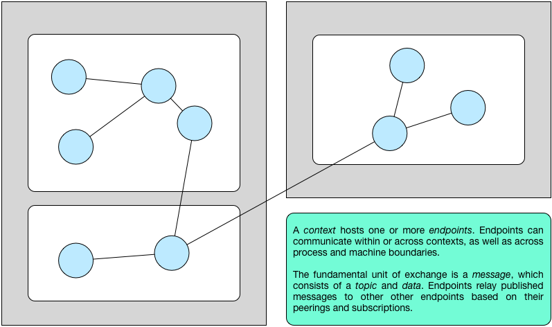

.. _introduction:

Introduction
============

The **Broker** library enables applications to communicate in `Bro
<https://bro.org>`_'s type-rich :ref:`data model <data-model>` via
publish/subscribe messaging. Moreover, Broker offers distributed
:ref:`key-value stores <data-stores>` to facilitate data management and
persistence.

Broker structures an application in terms of *endpoints*, which can enter
peering relationships to exchange messages with their neighbors. An endpoint
can send a message to its peers by publishing data under a specific *topic*.
Any endpoint that holds a subscription to the topic receives the corresponding
data.

The figure below introduces the graphic terminology we use throughout this
manual.

.. figure:: _images/terminology.png
  :align: center

Endpoints can efficiently communicate within the same OS process, as well as
transparently communicate with endpoints in a different OS process or on a
remote machine. This allows for a variety of different communication patterns.
The following figure illustrates an exemplary topology.

Broker currently does not support topologies that include loops. This is purely
a technical limitation and may vanish in the future.

There exist two API flavors: a synchronous (blocking) and asynchronous
(non-blocking) version. Internally, Broker operates entirely asynchronously by
leveraging the `C++ Actor Framework (CAF) <http://www.actor-framework.org>`_.
Users can receive messages either by calling a blocking function call until the
next message arrives, or by installing a callback for a specific topic.
