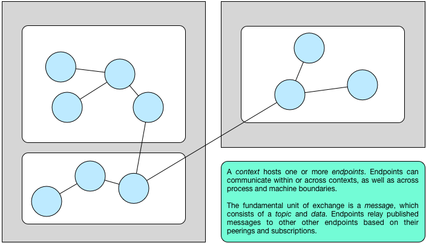
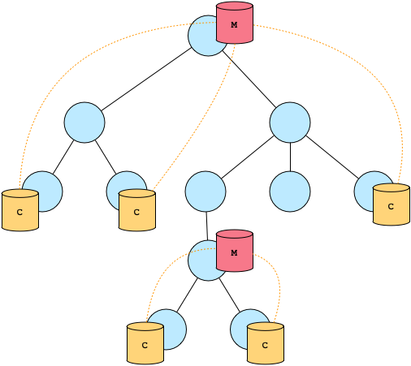

.. _overview:

Overview
========

The **Broker** library enables applications to communicate in Zeek_'s
type-rich :ref:`data model <data-model>` via publish/subscribe messaging.
Moreover, Broker offers distributed :ref:`key-value stores <data-stores>` to
facilitate unified data management and persistence.

The figure below introduces the graphic terminology we use throughout this
manual.

Moreover, all C++ code examples assume ``using namespace broker`` for
conciseness.

Communication
-------------

Broker structures an application in terms of *endpoints*, which represent data
senders and receivers. Endpoints can peer with other endpoints to communicate
with their neighbors. An endpoint can send a message to its peers by publishing
data under a specific *topic*. If any endpoint holds a subscription to the
topic, it will receive the corresponding data.

Endpoints can efficiently communicate within the same OS process, as well as
transparently communicate with endpoints in a different OS process or on a
remote machine. For in-memory endpoints, sending a message boils down to
passing a pointer. For remote communication, Broker serializes messages
transparently. This allows for a variety of different communication patterns.
The following figure illustrates an exemplary topology.

A process hosts one or more endpoints.  Endpoints can communicate within
or across processes as well as machine boundaries.

The fundamental unit of exchange is a *message*, which consists of a
*topic* and *data*.  Endpoints may choose to forward received messages
to their own peers that share a matching topic.

The API allows for both synchronous and asynchronous
communication. Internally, Broker operates entirely asynchronously by
leveraging the `C++ Actor Framework (CAF) <http://www.actor-framework.org>`_.
Users can receive messages either explicitly polling for them, or
by installing a callback to execute as they come in.

See :ref:`communication` for concrete usage examples.

Data Model
----------

Broker comes with a rich data model, since the library's primary objective
involves communication with Zeek_ and related applications. The fundamental unit
of communication is ``data``, which can hold any of the following concrete
types:

- ``none``
- ``boolean``
- ``count``
- ``integer``
- ``real``
- ``timespan``
- ``timestamp``
- ``string``
- ``address``
- ``subnet``
- ``port``
- ``vector``
- ``set``
- ``table``

:ref:`data-model` discusses the various types and their API in depth.

From these data units, one then composes *messages* to be exchanged.
Broker does generally not impose any further structure on messages,
it's up to sender and receiver to agree. For communication with Zeek,
however, Broker provides an additional *event* abstraction that defines
the specific message layout that Zeek expects for exchanging Zeek
events.

Data Stores
-----------

Data stores complement endpoint communication with a distributed key-value
abstraction operating in the full data model. One can attach one or more data
stores to an endpoint. A data store has a *frontend*, which determines its
behavior, and a *backend*, which represents the type of database for storing
data. There exist two types of frontends: *master* and *clone*. A master is the
authoritative source for the key-value store, whereas a clone represents a
local cache. Only the master can perform mutating operations on the store,
which it then pushes to all its clones over the existing peering communication
channel. A clone has a full copy of the data for faster access, but transparently  sends any
modifying operations to its master first. Only when the master propagates back
the change, the result of the operation becomes visible at the clone. The
figure below illustrates how one can deploy a master with several clones.

Each data store has a name that identifies the master. This name must be unique
among the endpoint's peers. The master can choose to keep its data in various
backends, which are currently: in-memory, `SQLite <https://www.sqlite.org>`_, and `RocksDB
<http://rocksdb.org>`_.

:ref:`data-stores` illustrates how to use data stores in different settings.

Troubleshooting
---------------

By default, Broker keeps console output to a minimum. When running a Broker
cluster, this bare minimum may omit too much information for troubleshooting.

Users can enable more output either by setting environment variables or by
providing a ``broker.conf`` file. Custom Broker appliations also may support
passing command line arguments (Zeek_ does not forward command line arguments to
Broker).

In order to get a high-level view of what Broker is doing internally, we
recommend settting:

::

    BROKER_CONSOLE_VERBOSITY=info

Settings this environment variable before running Zeek_ (or any other Broker
application) prints high-level events such as new network connections, peering
requests, etc. The runtime cost of enabling this option and the volume of
printed lines is moderate.

Troubleshooting a Broker application (or Zeek_ scripts that communicate over
Broker) sometimes requries tapping into the exchanged messages directly. Setting
the verbosity to debug instead will provide such details:

::

    BROKER_CONSOLE_VERBOSITY=debug

Note that using this verbosity level will slow down Broker and produce a high
volume of printed output.

Setting ``BROKER_FILE_VERBOSITY`` instead (or in addition) causes Broker to
print the output to a file. This is particularly useful when troubleshooting a
cluster, since it allows to run a test setup first and then collect all files
for the analysis.

The file output is also more detailled than the console output, as it includes
information such as source file locations, timestamps, and functions names.

In case setting environment variables is impossible or file-based configuration
is simply more convenient, creating a file called ``broker.conf`` in the working
directory of the application (before running it) provides an alternative way of
configuring Broker.

A minimal configuration file that sets console and file verbosity looks like
this:

::

    logger {
      ; note the single quotes!
      console-verbosity = 'info'
      file-verbosity = 'debug'
    }

The environment variables take precedence over configuration file entries
(but command line arguments have the highest priority).

Broker is based on CAF_, so *experienced* users can also use the ``broker.conf``
to  `tweak various settings
<https://actor-framework.readthedocs.io/en/stable/ConfiguringActorApplications.html>`_.
Making use of advanced features is most helpful for developers that contribute
to Broker's CAF-based C++ source code. For seeing the "full picture", including
CAF log output, developers can build CAF with log level ``debug`` or ``trace``
(either by calling ``configure --with-log-level=LVL`` or passing
``CAF_LOG_LEVEL=LVL`` to CMake directly when using the embedded CAF version) and
add the entry ``component-blacklist = []`` to the ``logger`` section of the
``broker.conf`` file.

.. _Zeek: https://www.zeek.org
.. _CAF: https://actor-framework.org
