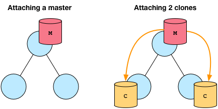
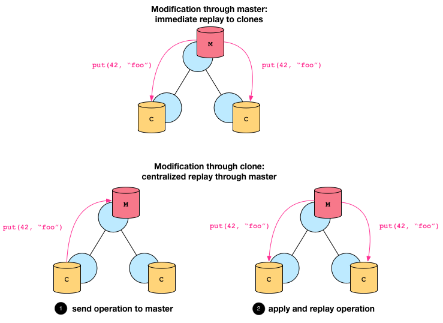

.. _data-stores:

Data Stores
===========

In addition to transmitting :ref:`data <data-model>` via publish/subscribe
communication, Broker also offers a mechanism to store this very data.
Data stores provide a distributed key-value interface that leverage the
existing :ref:`peer communication channels <communication>`.

Aspects
-------

A data store has two aspects: a *frontend* for interacting with the user, and a
*backend* that defines the database type for the key-value store.

Frontend
~~~~~~~~

Users interact with a data store through the frontend, which is either a
*master* or a *clone*. A master is authoritative for the store, whereas a clone
represents a local cache that is connected to the master. A clone cannot exist
without a master. Only the master can perform mutating operations on the store,
which it pushes out to all its clones. A clone has a full copy of the data for
faster access, but sends any modifying operations to its master first. Only
when the master propagates back the change, the result of the operation becomes
visible at the clone.

It is possible to attach one or more data stores to an endpoint, but each store
must have a unique master name. For example, two peers cannot both have a
master with the same name. When a clone connects to its master, it receives
full dump of the store:

While the master can apply mutating operations to the store directly, clones
have to first send the operation to the master and wait for the replay for the
operation to take on effect:

Backend
~~~~~~~

The master can choose to keep its data in various backends:

1. **Memory**. This backend uses a hash-table to keep its data in memory. It is
   the fastest of all backends, but offers limited scalability and (currently)
   does not support persistence.

2. `SQLite <https://www.sqlite.org>`_. The SQLite backend stores its data in a
   SQLite3 format on disk. While offering persistence, it does not scale very
   well.

3. `RocksDB <http://rocksdb.org>`_. This backend relies on an
   industrial-strength, high-performance database with a variety of tuning
   knobs. If your application requires persistence and also needs to scale,
   this backend is your best choice.

Operations
----------

Key operations on data stores include attaching it to an endpoint, performing
mutating operations, and retrieving values at specific keys.

Construction
~~~~~~~~~~~~

The example below illustrates how to attach a master frontend with a memory
backend:

.. code-block:: cpp

  context ctx;
  auto ep = ctx.spawn<nonblocking>();
  // attach a master with memory backend
  auto ds = ep.attach<master, memory>("foo");
  if (ds)

The factory function ``endpoint::attach`` has the following signature:

.. code-block:: cpp

  attach<F, B>(const std::string& name, backend_options opts = {})

The two template parameters ``F`` and ``B`` denote the respective frontend and
backend types, where ``B`` defaults to ``memory``.  The function takes as first
argument the name of the store and as second argument optionally a set of
backend options, such as the path where to keep the backend on the filesystem.
The function returns a ``expected<store>`` which encapsulates a type-erased
reference to the data store.

.. note::

  The type ``expected<T>`` encapsulates an instance of type ``T`` or an
  ``error``, with an interface that has "pointer semantics" for syntactic
  convenience:

  .. code-block:: cpp

    auto f(...) -> expected<T>;

    auto x = f();
    if (x)
      f(*x); // use instance of type T
    else
      std::cout << to_string(x.error()) << std::endl;

  In the failure case, the ``expected<T>::error()`` holds an ``error`` that
  can be compared against an error enumeration.

Modification
~~~~~~~~~~~~

Data stores support the following mutating operations:

1. ``put(key, value)``: stores ``value`` at ``key``, overwriting a potentially
   previously existing value at ``key``.

   .. code-block:: cpp

     ds.put(42, set{1, 2, 3});
     ds.put("foo", 4.2);

2. ``erase(key)``: removes the value for the given key, if ``key`` exists

   .. code-block:: cpp

     ds.erase(42);    // removes set{1, 2, 3}, which got inserted above
     ds.erase("bar"); // nop: key does not exist

.. note:: TODO: Document type-specific ``add`` and ``remove``.

Retrieval
~~~~~~~~~

There exist two methods of extracting values from a store: either in a blocking
or non-blocking fashion.

The overload ``get<blocking>(const data& key)`` retrieves a value in a blocking
manner and returns an instance of ``expected<data>``.

.. code-block:: cpp

  auto result = ds->get<blocking>("foo");
  if (result)
    std::cout << *result << std::endl; // may print 4.2
  else if (result.error() == ec::no_such_key)
    std::cout << "key 'foo' does not exist'" << std::endl;
  else if (result.error() == ec::backend_failure)
    std::cout << "something went wrong with the backend" << std::endl;
  else
    std::cout << "could not retrieve value at key 'foo'" << std::endl;

The overload ``get<nonblocking>(const data& key)`` returns a future-like proxy
object which has the sole purpose of invoking ``.then(...)`` on it to
install a one-shot handler that the runtime executes as soon as the result of
the retrieval operation is available.

.. code-block:: cpp

  ds->get<nonblocking>("foo").then(
    [=](const data& d) {
      std::cout << d << std::endl; // may print 4.2
    },
    [=](const error& e) {
      if (result.error() == ec::no_such_key)
        std::cout << "key 'foo' does not exist'" << std::endl;
      else if (result.error() == ec::backend_failure)
        std::cout << "something went wrong with the backend" << std::endl;
      else
        std::cout << "could not retrieve value at key 'foo'" << std::endl;
    }
  );
